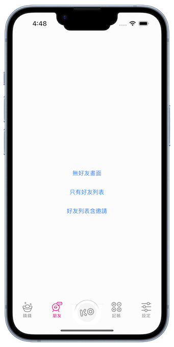
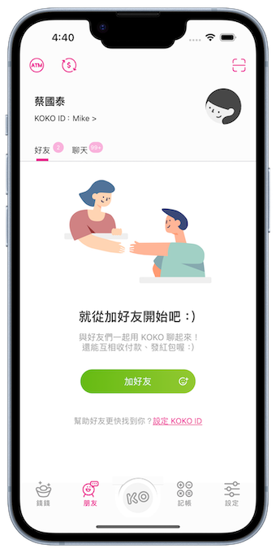
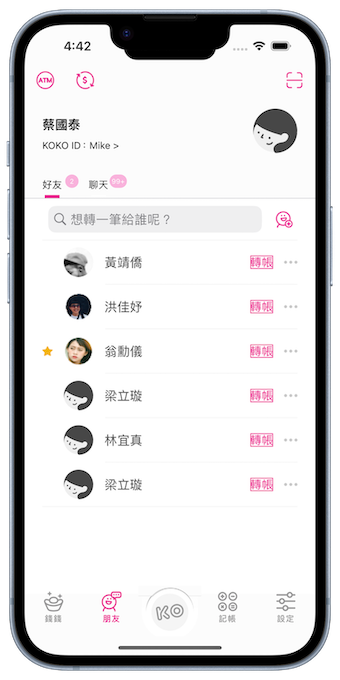
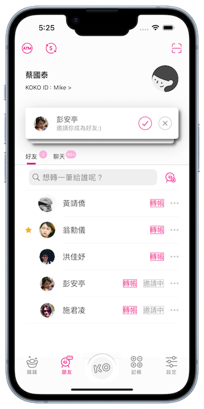

# KOKO Demo

## 說明
* 實作好友頁面，底下標籤列點選"朋友"會看到以下畫面：

## 實作內容
- [x] 以Swift／MVVM架構開發

- [x] 實作⾴⾯三種狀態：

1. 無好友時畫⾯

2. 有好友且無邀請資料時畫⾯

3. 有好友且有邀請時畫⾯

-

### 加分項目
* 好友列表⽀援下拉更新(重新呼叫request)

-

* 搜尋功能

-

* 邀請列表，可以點選打勾或打叉來回應邀請，選擇後"邀請中"狀態會消失

## 其他
* 測試環境：
    - [x] Xcode 14.0.1
    - [x] Xcode 15.0.1
* 開發工具：
    * Xcode 15.0.1
    * Postman
